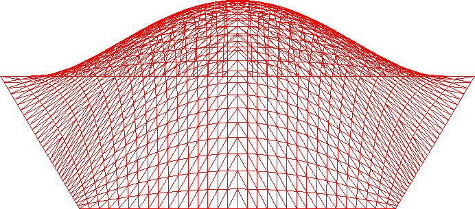

# Bezeir Surface using Tessellation Shaders
Tessellates a Bezeir surface using a tessellation shader. 

The control points of the Bezeir surface are defined in the tessellation evaluation shader. The surface is build using Bernstein polynomials.

## Controls

* Up/Down: Increase/Decrease tessellation factor
* w: Toggle wire frame

## References:
Tomas Akenine-Möller, Eric Haines, Naty Hoffman, Angelo Pesce, Michał Iwanicki, and Sébastien Hillaire, *Real-Time Rendering*, A K Peters/CRC Press, ISBN-13: 978-1138627000